# AI Final Project
# 使用 TensorFlow 進行時間序列預測

本教程是使用 TensorFlow 進行時間序列預測的簡介。它構建了幾種不同樣式的模型，包括卷積神經網路（CNN）和循環神經網路（RNN）。

## 本教程包括兩個主要部分，每個部分包含若干小節：

### 預測單個時間步驟：

- **單個特徵**

- **所有特徵**

### 預測多個時間步驟：

- **單次**：一次做出所有預測

- **自回歸**：一次做出一個預測，並將輸出饋送回模型

## *安裝*
```py
import os
import datetime

import IPython
import IPython.display
import matplotlib as mpl
import matplotlib.pyplot as plt
import numpy as np
import pandas as pd
import seaborn as sns
import tensorflow as tf

mpl.rcParams['figure.figsize'] = (8, 6)
mpl.rcParams['axes.grid'] = False
```
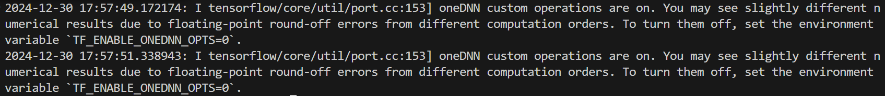

## 天氣數據集

本教程使用由[馬克斯·普朗克生物地球化學研究所](https://www.bgc-jena.mpg.de/wetter/)記錄的[天氣時間序列數據集](https://tensorflow.google.cn/tutorials/structured_data/time_series?hl=zh_cn#%E5%A4%A9%E6%B0%94%E6%95%B0%E6%8D%AE%E9%9B%86)。

此數據集包含了 14 個不同特徵，例如氣溫、氣壓和濕度。 自 2003 年起，這些數據每 10 分鐘就會被收集一次。為了提高效率，您將僅使用 2009 至 2016 年之間收集的數據。數據集的這一部分由 François Chollet 為他的[《Deep Learning with Python》](https://www.manning.com/books/deep-learning-with-python)一書所準備。

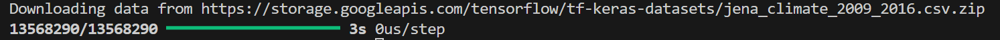
```py
zip_path = tf.keras.utils.get_file(
    origin='https://storage.googleapis.com/tensorflow/tf-keras-datasets/jena_climate_2009_2016.csv.zip',
    fname='jena_climate_2009_2016.csv.zip',
    extract=True)
csv_path, _ = os.path.splitext(zip_path)
```

本教程僅處理**每小時預測**，因此先從 10 分鐘間隔到 1 小時對數據進行下採樣：
```py
df = pd.read_csv(csv_path)
# Slice [start:stop:step], starting from index 5 take every 6th record.
df = df[5::6]

date_time = pd.to_datetime(df.pop('Date Time'), format='%d.%m.%Y %H:%M:%S')
```
讓我們看一下數據。 下面是前幾行：
```py
df.head()
```
| p (mbar) | T (degC) | Tpot (K) | Tdew (degC) | rh (%) | VPmax (mbar) | VPact (mbar) | VPdef (mbar) | sh (g/kg) | H2OC (mmol/mol) | rho (g/m**3) | wv (m/s) | max. wv (m/s) | wd (deg) |
| -------- | -------- | -------- | ----------- | ------ | ------------ | ------------ | ------------ | --------- | --------------- | ------------ | -------- | ------------- | -------- |
| 996.50   | -8.05    | 265.38   | -8.78       | 94.4   | 3.33         | 3.14         | 0.19         | 1.96      | 3.15            | 1307.86      | 0.21     | 0.63          | 192.7    |
| 996.62   | -8.88    | 264.54   | -9.77       | 93.2   | 3.12         | 2.90         | 0.21         | 1.81      | 2.91            | 1312.25      | 0.25     | 0.63          | 190.3    |
| 996.84   | -8.81    | 264.59   | -9.66       | 93.5   | 3.13         | 2.93         | 0.20         | 1.83      | 2.94            | 1312.18      | 0.18     | 0.63          | 167.2    |
| 996.99   | -9.05    | 264.34   | -10.02      | 92.6   | 3.07         | 2.85         | 0.23         | 1.78      | 2.85            | 1313.61      | 0.10     | 0.38          | 240.0    |
| 997.46   | -9.63    | 263.72   | -10.65      | 92.2   | 2.94         | 2.71         | 0.23         | 1.69      | 2.71            | 1317.19      | 0.40     | 0.88          | 157.0    |

下面是一些特徵隨時間的演變：
```py
plot_cols = ['T (degC)', 'p (mbar)', 'rho (g/m**3)']
plot_features = df[plot_cols]
plot_features.index = date_time
_ = plot_features.plot(subplots=True)

plot_features = df[plot_cols][:480]
plot_features.index = date_time[:480]
_ = plot_features.plot(subplots=True)
```

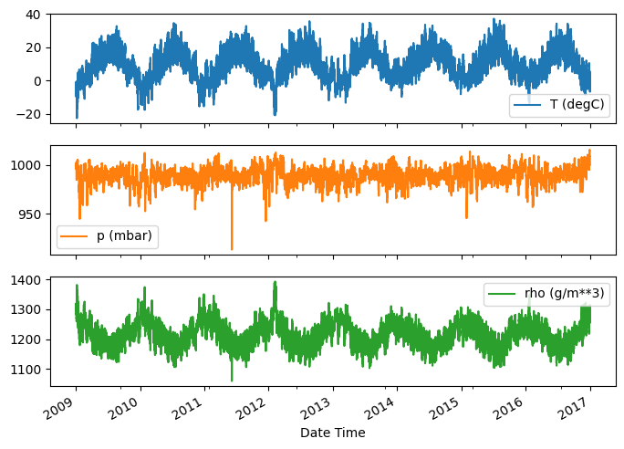
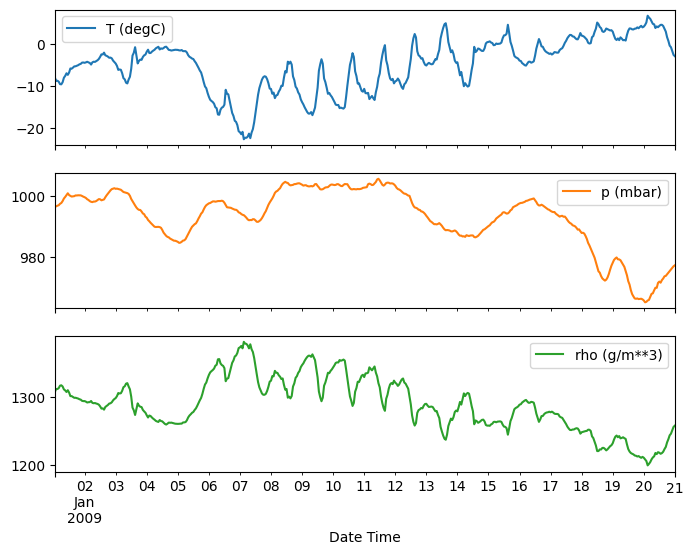
### 檢查和清理
 接下來，看一下數據集的統計數據：
```py
df.describe().transpose()
```
| 測量項目       | 計數       | 平均值      | 標準差      | 最小值      | 25百分位值 | 50百分位值 | 75百分位值 | 最大值      |
| ------------- | --------- | --------- | --------- | --------- | --------- | --------- | --------- | --------- |
| p (mbar)      | 70091.0   | 989.212842| 8.358886  | 913.60    | 984.20    | 989.57    | 994.720   | 1015.29   |
| T (degC)      | 70091.0   | 9.450482  | 8.423384  | -22.76    | 3.35      | 9.41      | 15.480    | 37.28     |
| Tpot (K)      | 70091.0   | 283.493086| 8.504424  | 250.85    | 277.44    | 283.46    | 289.530   | 311.21    |
| Tdew (degC)   | 70091.0   | 4.956471  | 6.730081  | -24.80    | 0.24      | 5.21      | 10.080    | 23.06     |
| rh (%)        | 70091.0   | 76.009788 | 16.474920 | 13.88     | 65.21     | 79.30     | 89.400    | 100.00    |
| VPmax (mbar)  | 70091.0   | 13.576576 | 7.739883  | 0.97      | 7.77      | 11.82     | 17.610    | 63.77     |
| VPact (mbar)  | 70091.0   | 9.533968  | 4.183658  | 0.81      | 6.22      | 8.86      | 12.360    | 28.25     |
| VPdef (mbar)  | 70091.0   | 4.042536  | 4.898549  | 0.00      | 0.87      | 2.19      | 5.300     | 46.01     |
| sh (g/kg)     | 70091.0   | 6.022560  | 2.655812  | 0.51      | 3.92      | 5.59      | 7.800     | 18.07     |
| H2OC (mmol/mol)| 70091.0  | 9.640437  | 4.234862  | 0.81      | 6.29      | 8.96      | 12.490    | 28.74     |
| rho (g/m**3)  | 70091.0   | 1216.061232 | 39.974263| 1059.45   | 1187.47   | 1213.80   | 1242.765  | 1393.54   |
| wv (m/s)      | 70091.0   | 1.702567  | 65.447512 | -9999.00  | 0.99      | 1.76      | 2.860     | 14.01     |
| max. wv (m/s) | 70091.0   | 2.963041  | 75.597657 | -9999.00  | 1.76      | 2.98      | 4.740     | 23.50     |
| wd (deg)      | 70091.0   | 174.789095| 86.619431 | 0.00      | 125.30    | 198.10    | 234.000   | 360.00    |

### 風速
值得注意的一件事是風速 （） 的 值和最大值 （） 列。 這個可能是錯誤的。``` wv (m/s)minmax. wv (m/s)-9999 ```

有一個單獨的風向列，因此速度應大於零 （）。 將其替換為零：```>=0```
```py
wv = df['wv (m/s)']
bad_wv = wv == -9999.0
wv[bad_wv] = 0.0

max_wv = df['max. wv (m/s)']
bad_max_wv = max_wv == -9999.0
max_wv[bad_max_wv] = 0.0

# The above inplace edits are reflected in the DataFrame.
df['wv (m/s)'].min()
```


### 特徵工程
在潛心構建模型之前，務必瞭解數據並確保傳遞格式正確的數據。

風數據的最後一列 以度為單位給出了風向。 角度不是很好的模型輸入：$360°$ 和 $ 0°$ 應該會彼此接近，並平滑換行。 如果不吹風，方向則無關緊要。```wd (deg)```

現在，風數據的分佈狀況如下：

```py
plt.hist2d(df['wd (deg)'], df['wv (m/s)'], bins=(50, 50), vmax=400)
plt.colorbar()
plt.xlabel('Wind Direction [deg]')
plt.ylabel('Wind Velocity [m/s]')
```
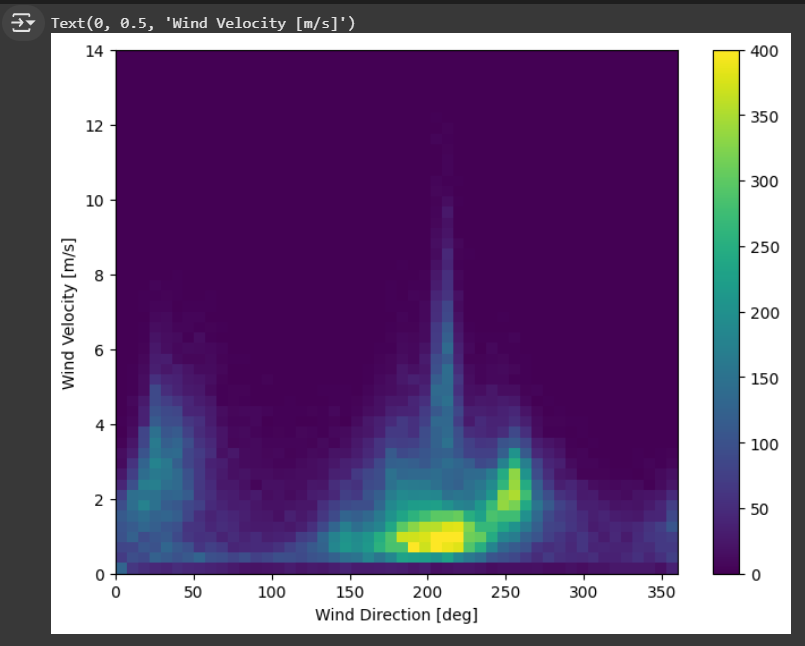

但是，如果將風向和風速列轉換為風向量，模型將更容易解釋：

```py
wv = df.pop('wv (m/s)')
max_wv = df.pop('max. wv (m/s)')

# Convert to radians.
wd_rad = df.pop('wd (deg)')*np.pi / 180

# Calculate the wind x and y components.
df['Wx'] = wv*np.cos(wd_rad)
df['Wy'] = wv*np.sin(wd_rad)

# Calculate the max wind x and y components.
df['max Wx'] = max_wv*np.cos(wd_rad)
df['max Wy'] = max_wv*np.sin(wd_rad)
```
模型正確解釋風向量的分佈要簡單得多：
```py
plt.hist2d(df['Wx'], df['Wy'], bins=(50, 50), vmax=400)
plt.colorbar()
plt.xlabel('Wind X [m/s]')
plt.ylabel('Wind Y [m/s]')
ax = plt.gca()
ax.axis('tight')
```

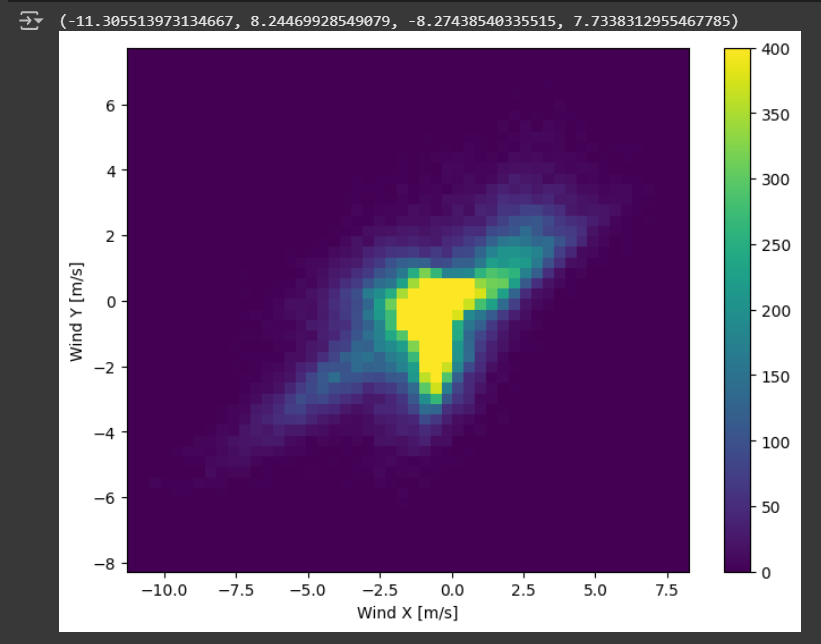
### 時間
同樣， 列非常有用，但不是以這種字串形式。 首先將其轉換為秒：```Date Time```
```py
timestamp_s = date_time.map(pd.Timestamp.timestamp)
```
與風向類似，以秒為單位的時間不是有用的模型輸入。 作為天氣數據，它有清晰的每日和每年週期性。 可以通過多種方式處理週期性。

您可以通過使用正弦和餘弦變換為清晰的「一天中的時間」和「一年中的時間」信號來獲得可用的信號：
```py
day = 24*60*60
year = (365.2425)*day

df['Day sin'] = np.sin(timestamp_s * (2 * np.pi / day))
df['Day cos'] = np.cos(timestamp_s * (2 * np.pi / day))
df['Year sin'] = np.sin(timestamp_s * (2 * np.pi / year))
df['Year cos'] = np.cos(timestamp_s * (2 * np.pi / year))
```
```py
plt.plot(np.array(df['Day sin'])[:25])
plt.plot(np.array(df['Day cos'])[:25])
plt.xlabel('Time [h]')
plt.title('Time of day signal')
```

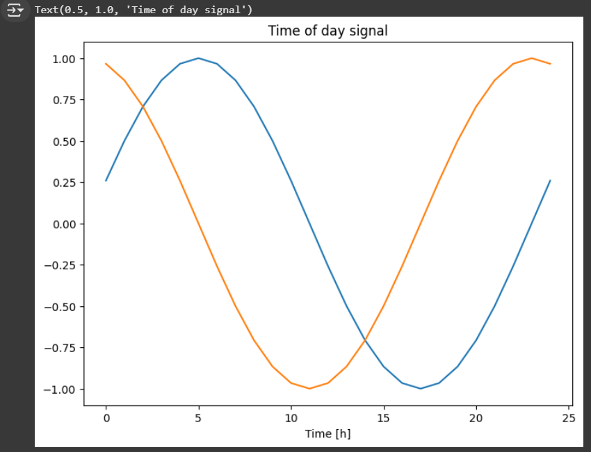

這使模型能夠訪問最重要的頻率特徵。 在這種情況下，您提前知道了哪些頻率很重要。

如果您沒有該資訊，則可以通過使用快速傅里葉變換提取特徵來確定哪些頻率重要。 要檢驗假設，下面是溫度隨時間變化的 tf.signal.rfft。 請注意 和 附近頻率的明顯峰值：```1/year1/day```

```py
fft = tf.signal.rfft(df['T (degC)'])
f_per_dataset = np.arange(0, len(fft))

n_samples_h = len(df['T (degC)'])
hours_per_year = 24*365.2524
years_per_dataset = n_samples_h/(hours_per_year)

f_per_year = f_per_dataset/years_per_dataset
plt.step(f_per_year, np.abs(fft))
plt.xscale('log')
plt.ylim(0, 400000)
plt.xlim([0.1, max(plt.xlim())])
plt.xticks([1, 365.2524], labels=['1/Year', '1/day'])
_ = plt.xlabel('Frequency (log scale)')
```
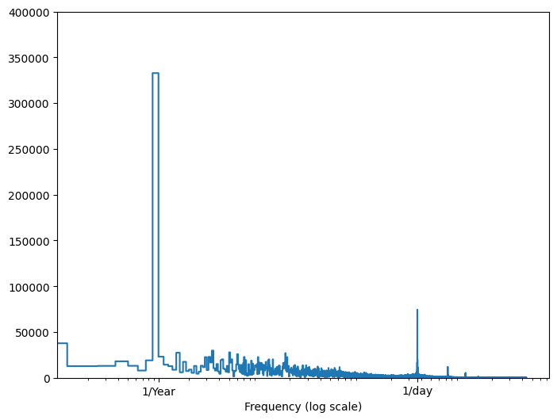
### 拆分數據
您將使用 拆分出訓練集、驗證集和測試集。 請注意，在拆分前數據**沒有**隨機打亂順序。 這有兩個原因：```(70%, 20%, 10%)```
1. 確保仍然可以將數據切入連續樣本的視窗

2. 確保訓練后在收集的數據上對模型進行評估，驗證/測試結果更加真實。
```py
column_indices = {name: i for i, name in enumerate(df.columns)}

n = len(df)
train_df = df[0:int(n*0.7)]
val_df = df[int(n*0.7):int(n*0.9)]
test_df = df[int(n*0.9):]

num_features = df.shape[1]
```
### 歸一化數據
在訓練神經網路之前縮放特徵很重要。 歸一化是進行此類縮放的常見方式：減去平均值，然後除以每個特徵的標準偏差。

平均值和標準偏差應僅使用訓練數據進行計算，從而使模型無法訪問驗證集和測試集中的值。

有待商榷的是：模型在訓練時不應訪問訓練集中的未來值，以及應該使用移動平均數來進行此類規範化。 這不是本教程的重點，驗證集和測試集會確保我們獲得（某種程度上）可靠的指標。 因此，為了簡單起見，本教程使用的是簡單平均數。
```py
train_mean = train_df.mean()
train_std = train_df.std()

train_df = (train_df - train_mean) / train_std
val_df = (val_df - train_mean) / train_std
test_df = (test_df - train_mean) / train_std
```
現在看一下這些特徵的分佈。 部分特徵的尾部確實很長，但沒有類似 風速值的明顯錯誤. ```-9999```
```py 
df_std = (df - train_mean) / train_std
df_std = df_std.melt(var_name='Column', value_name='Normalized')
plt.figure(figsize=(12, 6))
ax = sns.violinplot(x='Column', y='Normalized', data=df_std)
_ = ax.set_xticklabels(df.keys(), rotation=90)
```
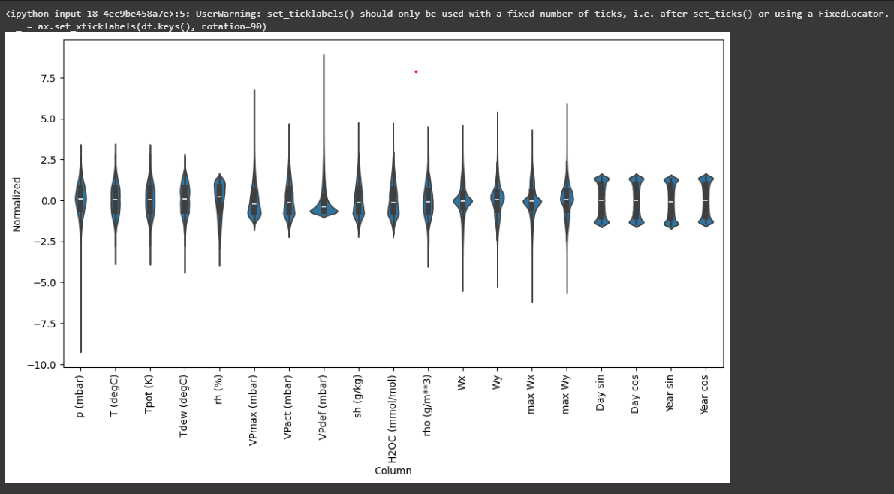
## 數據視窗化
本教程中的模型將基於來自數據連續樣本的窗口進行一組預測。

輸入視窗的主要特徵包括：
- . 輸入和標籤視窗的寬度（時間步驟數量）。
- 它們之間的時間偏移量。
- 用作輸入、標籤或兩者的特徵。
本教程構建了各種模型（包括線性、DNN、CNN 和 RNN 模型），並將它們用於以下兩種情況：
- 單輸出和多輸出預測。
- 單時間步驟和多時間步驟預測。
本部分重點介紹實現數據視窗化，以便將其重用到上述所有模型。

根據任務和模型類型，您可能需要生成各種資料視窗。 下面是一些範例：
1. 例如，要在給定 24 小時歷史記錄的情況下對未來 24 小時作出一次預測，可以定義如下視窗：

1. 給定 6 小時的歷史記錄，對未來 1 小時作出一次預測的模型將需要類似下面的視窗：
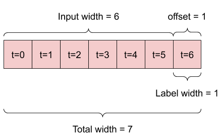

本部分的剩餘內容會定義 類。 此類可以：```WindowGenerator```
1. 處理如上圖所示的索引和偏移量。
2. 將特徵視窗拆分為 對。```(features, labels)```
3. 繪製結果視窗的內容。
4. 使用 [tf.data.Dataset](https://tensorflow.google.cn/api_docs/python/tf/data/Dataset?hl=zh-cn) 從訓練、評估和測試數據高效生成這些視窗的批次。

### 1. 索引和偏移量
首先創建 類。 方法包含輸入和標籤索引的所有必要邏輯。```WindowGenerator__init__```

它還將訓練、評估和測試 DataFrame 作為輸出。 這些稍後將被轉換為視窗的 [tf.data.Dataset。](https://tensorflow.google.cn/api_docs/python/tf/data/Dataset?hl=zh-cn)
```py 
class WindowGenerator():
  def __init__(self, input_width, label_width, shift,
               train_df=train_df, val_df=val_df, test_df=test_df,
               label_columns=None):
    # Store the raw data.
    self.train_df = train_df
    self.val_df = val_df
    self.test_df = test_df

    # Work out the label column indices.
    self.label_columns = label_columns
    if label_columns is not None:
      self.label_columns_indices = {name: i for i, name in
                                    enumerate(label_columns)}
    self.column_indices = {name: i for i, name in
                           enumerate(train_df.columns)}

    # Work out the window parameters.
    self.input_width = input_width
    self.label_width = label_width
    self.shift = shift

    self.total_window_size = input_width + shift

    self.input_slice = slice(0, input_width)
    self.input_indices = np.arange(self.total_window_size)[self.input_slice]

    self.label_start = self.total_window_size - self.label_width
    self.labels_slice = slice(self.label_start, None)
    self.label_indices = np.arange(self.total_window_size)[self.labels_slice]

  def __repr__(self):
    return '\n'.join([
        f'Total window size: {self.total_window_size}',
        f'Input indices: {self.input_indices}',
        f'Label indices: {self.label_indices}',
        f'Label column name(s): {self.label_columns}'])
```
下面是建立本部份開頭圖表中所示的兩個視窗的代碼：
```py
w1 = WindowGenerator(input_width=24, label_width=1, shift=24,
                     label_columns=['T (degC)'])
w1
```
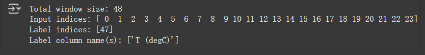
```py
w2 = WindowGenerator(input_width=6, label_width=1, shift=1,
                     label_columns=['T (degC)'])
w2
```
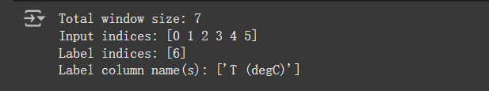
### 2. 拆分
給定一個連續輸入的清單，```split_window``` 方法會將它們轉換為輸入視窗和標籤視窗。

您之前定義的範例```w2``` 將按以下方式分割：

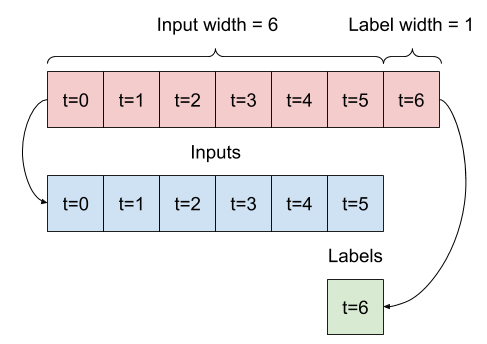

此圖不顯示數據的 軸，但此 函數還會處理 ，因此可以將其用於單輸出和多輸出樣本。```featuressplit_windowlabel_columns```
```py
def split_window(self, features):
  inputs = features[:, self.input_slice, :]
  labels = features[:, self.labels_slice, :]
  if self.label_columns is not None:
    labels = tf.stack(
        [labels[:, :, self.column_indices[name]] for name in self.label_columns],
        axis=-1)

  # Slicing doesn't preserve static shape information, so set the shapes
  # manually. This way the `tf.data.Datasets` are easier to inspect.
  inputs.set_shape([None, self.input_width, None])
  labels.set_shape([None, self.label_width, None])

  return inputs, labels

WindowGenerator.split_window = split_window
```
試試以下代碼：
```py
# Stack three slices, the length of the total window.
example_window = tf.stack([np.array(train_df[:w2.total_window_size]),
                           np.array(train_df[100:100+w2.total_window_size]),
                           np.array(train_df[200:200+w2.total_window_size])])

example_inputs, example_labels = w2.split_window(example_window)

print('All shapes are: (batch, time, features)')
print(f'Window shape: {example_window.shape}')
print(f'Inputs shape: {example_inputs.shape}')
print(f'Labels shape: {example_labels.shape}')
```

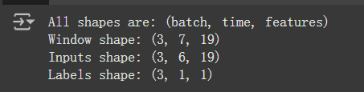
通常，TensorFlow 中的數據會被打包到陣列中，其中最外層索引是交叉樣本（“批次”維度）。 中間索引是“時間”和“空間”（寬度、高度）維度。 最內層索引是特徵。

上面的代碼使用了三個 7 時間步驟視窗的批次，每個時間步驟有 19 個特徵。 它將其拆分成一個 6 時間步驟的批次、19 個特徵輸入和一個 1 時間步驟 1 特徵的標籤。 該標籤僅有一個特徵，因為 已使用 進行了初始化。 最初，本教程將構建預測單個輸出標籤的模型。```WindowGeneratorlabel_columns=['T (degC)']```

### 3.繪圖
下面是一個繪圖方法，可以對拆分視窗進行簡單可視化：
```py
w2.example = example_inputs, example_labels
```
```py
def plot(self, model=None, plot_col='T (degC)', max_subplots=3):
  inputs, labels = self.example
  plt.figure(figsize=(12, 8))
  plot_col_index = self.column_indices[plot_col]
  max_n = min(max_subplots, len(inputs))
  for n in range(max_n):
    plt.subplot(max_n, 1, n+1)
    plt.ylabel(f'{plot_col} [normed]')
    plt.plot(self.input_indices, inputs[n, :, plot_col_index],
             label='Inputs', marker='.', zorder=-10)

    if self.label_columns:
      label_col_index = self.label_columns_indices.get(plot_col, None)
    else:
      label_col_index = plot_col_index

    if label_col_index is None:
      continue

    plt.scatter(self.label_indices, labels[n, :, label_col_index],
                edgecolors='k', label='Labels', c='#2ca02c', s=64)
    if model is not None:
      predictions = model(inputs)
      plt.scatter(self.label_indices, predictions[n, :, label_col_index],
                  marker='X', edgecolors='k', label='Predictions',
                  c='#ff7f0e', s=64)

    if n == 0:
      plt.legend()

  plt.xlabel('Time [h]')

WindowGenerator.plot = plot
```

此繪圖根據專案引用的時間來對齊輸入、標籤和（稍後的）預測：
```py
w2.plot()
```
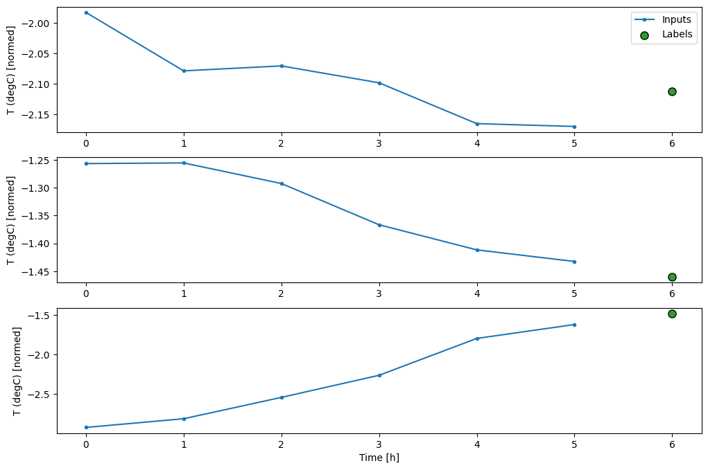
您可以繪製其他列，但是樣本視窗 配置僅包含 列的標籤。```w2T (degC)```
```py 
w2.plot(plot_col='p (mbar)')
```
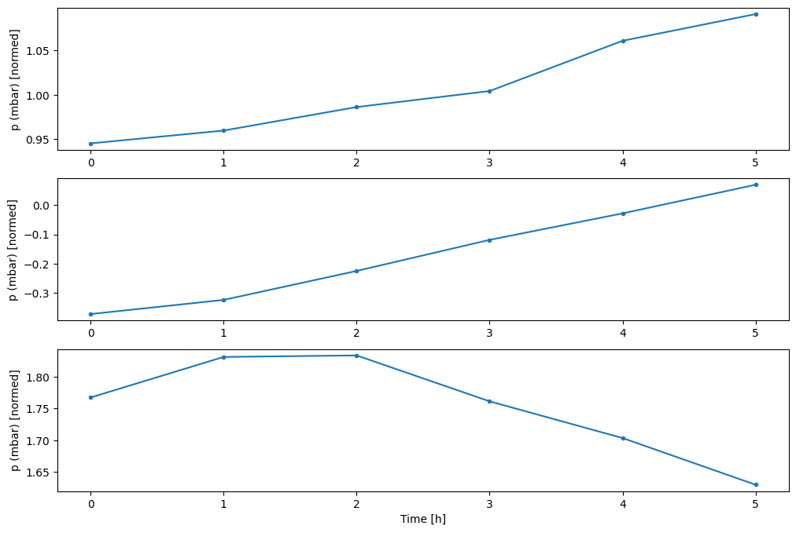
### 4. 創建 [tf.data.Dataset](https://tensorflow.google.cn/api_docs/python/tf/data/Dataset?hl=zh-cn)

最後，此```make_dataset```方法將獲取時間序列 DataFrame 並使用 [tf.keras.utils.timeseries_dataset_from_array](https://tensorflow.google.cn/api_docs/python/tf/keras/utils/timeseries_dataset_from_array?hl=zh-cn) 函數將其轉換為```(input_window, label_window)```對的 [tf.data.Dataset](https://tensorflow.google.cn/api_docs/python/tf/data/Dataset?hl=zh-cn)。

```py
def make_dataset(self, data):
  data = np.array(data, dtype=np.float32)
  ds = tf.keras.utils.timeseries_dataset_from_array(
      data=data,
      targets=None,
      sequence_length=self.total_window_size,
      sequence_stride=1,
      shuffle=True,
      batch_size=32,)

  ds = ds.map(self.split_window)

  return ds

WindowGenerator.make_dataset = make_dataset
```
`WindowGenerator `物件包含訓練、驗證和測試數據。

使用您之前定義的 `make_dataset` 方法添加属性以作為 [tf.data.Dataset](https://tensorflow.google.cn/api_docs/python/tf/data/Dataset?hl=zh-cn) 訪問他們。此外，添加一個標準樣本批次以便於訪問和繪圖：
```py
@property
def train(self):
  return self.make_dataset(self.train_df)

@property
def val(self):
  return self.make_dataset(self.val_df)

@property
def test(self):
  return self.make_dataset(self.test_df)

@property
def example(self):
  """Get and cache an example batch of `inputs, labels` for plotting."""
  result = getattr(self, '_example', None)
  if result is None:
    # No example batch was found, so get one from the `.train` dataset
    result = next(iter(self.train))
    # And cache it for next time
    self._example = result
  return result

WindowGenerator.train = train
WindowGenerator.val = val
WindowGenerator.test = test
WindowGenerator.example = example
```
现在，`WindowGenerator` 对象允许您访问 [tf.data.Dataset](https://tensorflow.google.cn/api_docs/python/tf/data/Dataset?hl=zh-cn) 对象，因此您可以轻松迭代数据。
[Dataset.element_spec](https://tensorflow.google.cn/api_docs/python/tf/data/Dataset?hl=zh-cn#element_spec) 属性会告诉您数据集元素的结构、数据类型和形状。
```py
# Each element is an (inputs, label) pair.
w2.train.element_spec
```
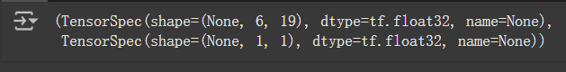
在 `Dataset` 上进行迭代会产生具体批次：
```py
for example_inputs, example_labels in w2.train.take(1):
  print(f'Inputs shape (batch, time, features): {example_inputs.shape}')
  print(f'Labels shape (batch, time, features): {example_labels.shape}')
  ```

## 單步模型

基於此類數據能夠構建的最簡單模型，能夠僅根據當前條件預測單個特徵的值，即未來的一個時間步驟（1 小時）。

因此，從構建模型開始，預測未來 1 小時的`T (degC)`值。


#### 預測下一個時間步驟

設定物件`WindowGenerator`以產生下列單步`(input, label)`對：
```py
single_step_window = WindowGenerator(
    input_width=1, label_width=1, shift=1,
    label_columns=['T (degC)'])
single_step_window
```
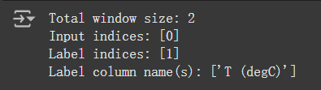

window 會根據訓練、驗證和測試集創建`tf.data.Datasets`，使您可以輕鬆反覆運算數據批次。
```py
for example_inputs, example_labels in single_step_window.train.take(1):
  print(f'Inputs shape (batch, time, features): {example_inputs.shape}')
  print(f'Labels shape (batch, time, features): {example_labels.shape}')
  ```
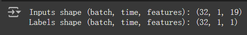


### 基線

在構建可訓練模型之前，最好將性能基線作為與以後更複雜的模型進行比較的點。

第一個任務是在給定所有特徵的當前值的情況下，預測未來 1 小時的溫度。當前值包括當前溫度。

因此，從僅返回當前溫度作為預測值的模型開始，預測“無變化”。這是一個合理的基線，因為溫度變化緩慢。當然，如果您對更遠的未來進行預測，此基線的效果就不那麼好了。
```py 
class Baseline(tf.keras.Model):
  def __init__(self, label_index=None):
    super().__init__()
    self.label_index = label_index

  def call(self, inputs):
    if self.label_index is None:
      return inputs
    result = inputs[:, :, self.label_index]
    return result[:, :, tf.newaxis]
```
实例化并评估此模型：
```py

baseline = Baseline(label_index=column_indices['T (degC)'])

baseline.compile(loss=tf.keras.losses.MeanSquaredError(),
                 metrics=[tf.keras.metrics.MeanAbsoluteError()])

val_performance = {}
performance = {}
val_performance['Baseline'] = baseline.evaluate(single_step_window.val)
performance['Baseline'] = baseline.evaluate(single_step_window.test, verbose=0)
```
```
439/439 ━━━━━━━━━━━━━━━━━━━━ 2s 3ms/step - loss: 0.0133 - mean_absolute_error: 0.0790
```

上面的代碼列印了一些性能指標，但這些指標並沒有使您對模型的運行情況有所瞭解。

`WindowGenerator` 有一種繪製方法，但只有一個樣本，繪圖不是很有趣。

因此，創建一個更寬的來一次生成包含 24 小時連續輸入和標籤的視窗。新的變數不會更改模型的運算方式。模型仍會根據單個輸入時間步驟對未來 1 小時進行預測。這裡 `window` 軸的作用類似於 `time` 軸：每個預測都是獨立進行的，時間步驟之間沒有交互：
```PY
wide_window = WindowGenerator(
    input_width=24, label_width=24, shift=1,
    label_columns=['T (degC)'])

wide_window
```

此擴展視窗可以直接傳遞到相同的`baseline`模型，而無需修改任何代碼。 能做到這一點是因為輸入和標籤具有相同數量的時間步驟，並且基線只是將輸入轉發至輸出：
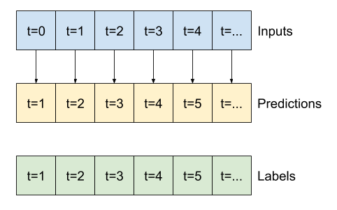
```PY
print('Input shape:', wide_window.example[0].shape)
print('Output shape:', baseline(wide_window.example[0]).shape)
```
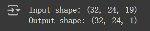

通過繪製基線模型的預測值，可以注意到只是標籤向右移動了 1 小時：

```PY
wide_window.plot(baseline)
```
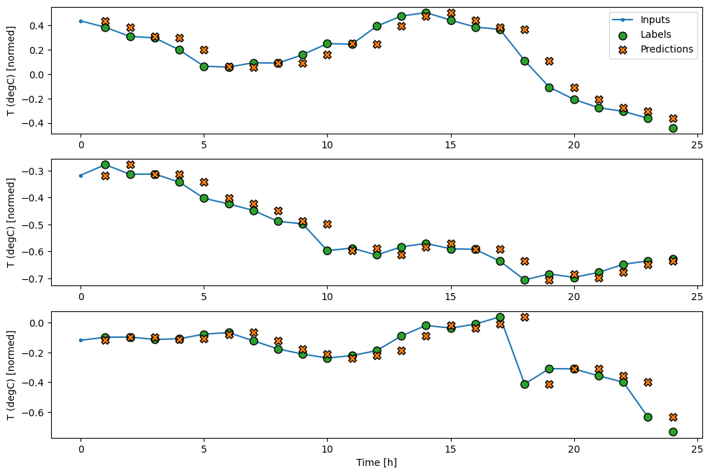
在上面三個樣本的繪圖中，單步模型運行了 24 個小時。 這需要一些解釋：

- 藍色的 `Inputs`行顯示每個時間步驟的輸入溫度。 模型會接收所有特徵，而該繪圖僅顯示溫度。
- 綠色的 `Labels`點顯示目標預測值。 這些點在預測時間，而不是輸入時間顯示。 這就是為什麼標籤範圍相對於輸入移動了 1 步。
- 橙色的 `Predictions`叉是模型針對每個輸出時間步驟的預測。 如果模型能夠進行完美預測，則預測值將直接落在`Labels` 上。
### 線性模型
可以應用於此任務的最簡單的**可訓練**模型是在輸入和輸出之間插入線性轉換。 在這種情況下，時間步驟的輸出僅取決於該步驟：

没有设置 `activation` 的` tf.keras.layers.Dense` 层是线性模型。层仅会将数据的最后一个轴从 `(batch, time, inputs)` 转换为` (batch, time, units)`；它会单独应用于 `batch `和` time `轴的每个条目。
```py
linear = tf.keras.Sequential([
    tf.keras.layers.Dense(units=1)
])
```
```py
print('Input shape:', single_step_window.example[0].shape)
print('Output shape:', linear(single_step_window.example[0]).shape)
```
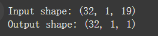

本教程训练许多模型，因此将训练过程打包到一个函数中：
```py
MAX_EPOCHS = 20

def compile_and_fit(model, window, patience=2):
  early_stopping = tf.keras.callbacks.EarlyStopping(monitor='val_loss',
                                                    patience=patience,
                                                    mode='min')

  model.compile(loss=tf.keras.losses.MeanSquaredError(),
                optimizer=tf.keras.optimizers.Adam(),
                metrics=[tf.keras.metrics.MeanAbsoluteError()])

  history = model.fit(window.train, epochs=MAX_EPOCHS,
                      validation_data=window.val,
                      callbacks=[early_stopping])
  return history
```
训练模型并评估其性能：
```py
history = compile_and_fit(linear, single_step_window)

val_performance['Linear'] = linear.evaluate(single_step_window.val)
performance['Linear'] = linear.evaluate(single_step_window.test, verbose=0)
```
```
Epoch 1/20
1534/1534 ━━━━━━━━━━━━━━━━━━━━ 7s 4ms/step - loss: 0.4903 - mean_absolute_error: 0.4637 - val_loss: 0.0191 - val_mean_absolute_error: 0.1003
Epoch 2/20
1534/1534 ━━━━━━━━━━━━━━━━━━━━ 12s 5ms/step - loss: 0.0146 - mean_absolute_error: 0.0894 - val_loss: 0.0096 - val_mean_absolute_error: 0.0727
Epoch 3/20
1534/1534 ━━━━━━━━━━━━━━━━━━━━ 11s 5ms/step - loss: 0.0097 - mean_absolute_error: 0.0724 - val_loss: 0.0092 - val_mean_absolute_error: 0.0705
Epoch 4/20
1534/1534 ━━━━━━━━━━━━━━━━━━━━ 8s 4ms/step - loss: 0.0093 - mean_absolute_error: 0.0708 - val_loss: 0.0089 - val_mean_absolute_error: 0.0693
Epoch 5/20
1534/1534 ━━━━━━━━━━━━━━━━━━━━ 8s 5ms/step - loss: 0.0093 - mean_absolute_error: 0.0705 - val_loss: 0.0090 - val_mean_absolute_error: 0.0696
Epoch 6/20
1534/1534 ━━━━━━━━━━━━━━━━━━━━ 7s 5ms/step - loss: 0.0092 - mean_absolute_error: 0.0702 - val_loss: 0.0088 - val_mean_absolute_error: 0.0687
Epoch 7/20
1534/1534 ━━━━━━━━━━━━━━━━━━━━ 7s 4ms/step - loss: 0.0092 - mean_absolute_error: 0.0700 - val_loss: 0.0088 - val_mean_absolute_error: 0.0691
Epoch 8/20
1534/1534 ━━━━━━━━━━━━━━━━━━━━ 9s 6ms/step - loss: 0.0092 - mean_absolute_error: 0.0701 - val_loss: 0.0088 - val_mean_absolute_error: 0.0687
Epoch 9/20
1534/1534 ━━━━━━━━━━━━━━━━━━━━ 7s 5ms/step - loss: 0.0091 - mean_absolute_error: 0.0699 - val_loss: 0.0088 - val_mean_absolute_error: 0.0687
Epoch 10/20
1534/1534 ━━━━━━━━━━━━━━━━━━━━ 11s 5ms/step - loss: 0.0091 - mean_absolute_error: 0.0698 - val_loss: 0.0087 - val_mean_absolute_error: 0.0682
Epoch 11/20
1534/1534 ━━━━━━━━━━━━━━━━━━━━ 7s 5ms/step - loss: 0.0091 - mean_absolute_error: 0.0698 - val_loss: 0.0087 - val_mean_absolute_error: 0.0685
Epoch 12/20
1534/1534 ━━━━━━━━━━━━━━━━━━━━ 10s 4ms/step - loss: 0.0091 - mean_absolute_error: 0.0697 - val_loss: 0.0087 - val_mean_absolute_error: 0.0678
Epoch 13/20
1534/1534 ━━━━━━━━━━━━━━━━━━━━ 11s 5ms/step - loss: 0.0091 - mean_absolute_error: 0.0696 - val_loss: 0.0087 - val_mean_absolute_error: 0.0682
Epoch 14/20
1534/1534 ━━━━━━━━━━━━━━━━━━━━ 8s 5ms/step - loss: 0.0091 - mean_absolute_error: 0.0696 - val_loss: 0.0087 - val_mean_absolute_error: 0.0682
Epoch 15/20
1534/1534 ━━━━━━━━━━━━━━━━━━━━ 7s 5ms/step - loss: 0.0091 - mean_absolute_error: 0.0696 - val_loss: 0.0087 - val_mean_absolute_error: 0.0684
439/439 ━━━━━━━━━━━━━━━━━━━━ 1s 3ms/step - loss: 0.0087 - mean_absolute_error: 0.0684
```
与 `baseline` 模型类似，可以在宽度窗口的批次上调用线性模型。使用这种方式，模型会在连续的时间步骤上进行一系列独立预测。`time` 轴的作用类似于另一个 `batch` 轴。在每个时间步骤上，预测之间没有交互。

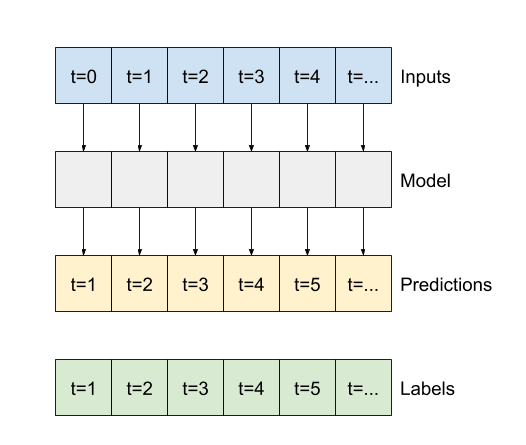

```py
print('Input shape:', wide_window.example[0].shape)
print('Output shape:', baseline(wide_window.example[0]).shape)
```
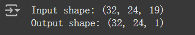

下面是 `wide_widow `上它的样本预测绘图。请注意，在许多情况下，预测值显然比仅返回输入温度更好，但在某些情况下则会更差：
```py
wide_window.plot(linear)
```
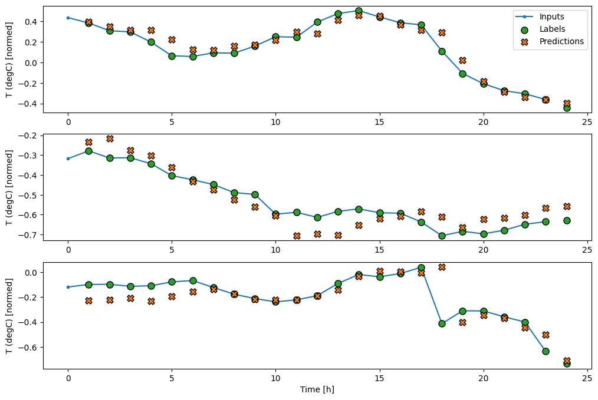

线性模型的优点之一是它们相对易于解释。您可以拉取层的权重，并呈现分配给每个输入的权重：
```py
plt.bar(x = range(len(train_df.columns)),
        height=linear.layers[0].kernel[:,0].numpy())
axis = plt.gca()
axis.set_xticks(range(len(train_df.columns)))
_ = axis.set_xticklabels(train_df.columns, rotation=90)
```
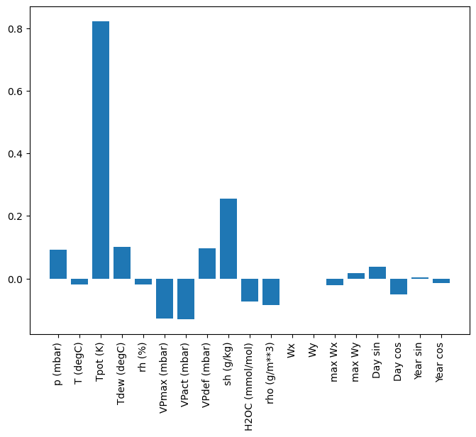

有时模型甚至不会将大多数权重放在输入` T (degC)` 上。这是随机初始化的风险之一。
### 密集
在应用实际运算多个时间步骤的模型之前，值得研究一下更深、更强大的单输入步骤模型的性能。

下面是一个与` linear` 模型类似的模型，只不过它在输入和输出之间堆叠了几个` Dense` 层：
```py
dense = tf.keras.Sequential([
    tf.keras.layers.Dense(units=64, activation='relu'),
    tf.keras.layers.Dense(units=64, activation='relu'),
    tf.keras.layers.Dense(units=1)
])

history = compile_and_fit(dense, single_step_window)

val_performance['Dense'] = dense.evaluate(single_step_window.val)
performance['Dense'] = dense.evaluate(single_step_window.test, verbose=0)
```
```
Epoch 1/20
1534/1534 ━━━━━━━━━━━━━━━━━━━━ 12s 7ms/step - loss: 0.0306 - mean_absolute_error: 0.1047 - val_loss: 0.0082 - val_mean_absolute_error: 0.0669
Epoch 2/20
1534/1534 ━━━━━━━━━━━━━━━━━━━━ 19s 6ms/step - loss: 0.0080 - mean_absolute_error: 0.0646 - val_loss: 0.0076 - val_mean_absolute_error: 0.0633
Epoch 3/20
1534/1534 ━━━━━━━━━━━━━━━━━━━━ 11s 6ms/step - loss: 0.0075 - mean_absolute_error: 0.0623 - val_loss: 0.0070 - val_mean_absolute_error: 0.0601
Epoch 4/20
1534/1534 ━━━━━━━━━━━━━━━━━━━━ 11s 7ms/step - loss: 0.0073 - mean_absolute_error: 0.0614 - val_loss: 0.0072 - val_mean_absolute_error: 0.0605
Epoch 5/20
1534/1534 ━━━━━━━━━━━━━━━━━━━━ 9s 6ms/step - loss: 0.0071 - mean_absolute_error: 0.0600 - val_loss: 0.0073 - val_mean_absolute_error: 0.0610
439/439 ━━━━━━━━━━━━━━━━━━━━ 1s 3ms/step - loss: 0.0071 - mean_absolute_error: 0.0609
```

### 多步密集
单时间步骤模型没有其输入的当前值的上下文。它看不到输入特征随时间变化的情况。要解决此问题，模型在进行预测时需要访问多个时间步骤：


`baseline`、`linear` 和 `dense` 模型会单独处理每个时间步骤。在这里，模型将接受多个时间步骤作为输入，以生成单个输出。

创建一个`WindowGenerator`，它将生成 3 小时输入和 1 小时标签的批次：

请注意，`Window` 的 `shift` 参数与两个窗口的末尾相关。

```py
CONV_WIDTH = 3
conv_window = WindowGenerator(
    input_width=CONV_WIDTH,
    label_width=1,
    shift=1,
    label_columns=['T (degC)'])

conv_window
```

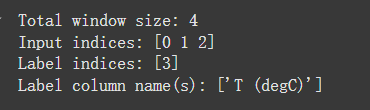

```py
conv_window.plot()
plt.title("Given 3 hours of inputs, predict 1 hour into the future.")
```

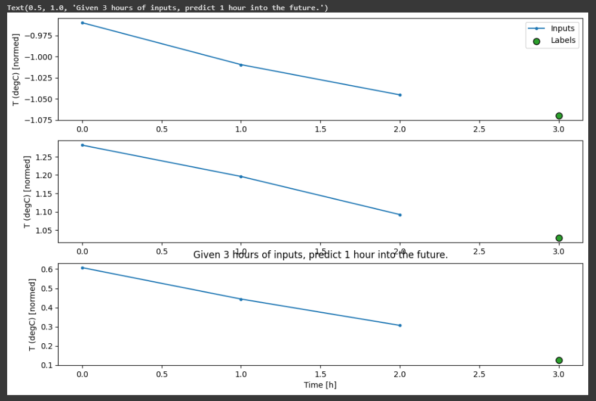

您可以通过添加` tf.keras.layers.Flatten` 作为模型的第一层，在多输入步骤窗口上训练` dense` 模型：
```py
multi_step_dense = tf.keras.Sequential([
    # Shape: (time, features) => (time*features)
    tf.keras.layers.Flatten(),
    tf.keras.layers.Dense(units=32, activation='relu'),
    tf.keras.layers.Dense(units=32, activation='relu'),
    tf.keras.layers.Dense(units=1),
    # Add back the time dimension.
    # Shape: (outputs) => (1, outputs)
    tf.keras.layers.Reshape([1, -1]),
])
```
```py 
print('Input shape:', conv_window.example[0].shape)
print('Output shape:', multi_step_dense(conv_window.example[0]).shape)
```
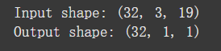

```py
history = compile_and_fit(multi_step_dense, conv_window)

IPython.display.clear_output()
val_performance['Multi step dense'] = multi_step_dense.evaluate(conv_window.val)
performance['Multi step dense'] = multi_step_dense.evaluate(conv_window.test, verbose=0)
```
```
438/438 ━━━━━━━━━━━━━━━━━━━━ 2s 3ms/step - loss: 0.0071 - mean_absolute_error: 0.0596
```

```py
conv_window.plot(multi_step_dense)
```
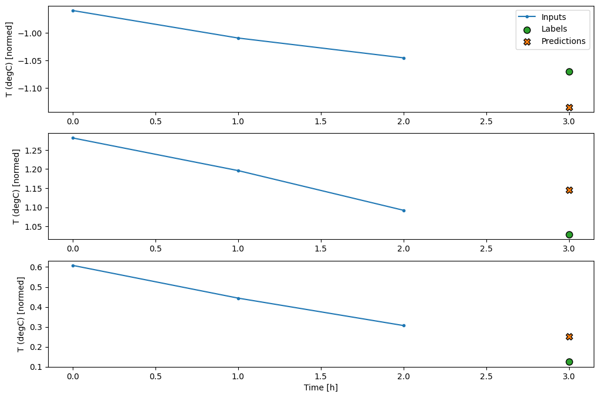

此方法的主要缺点是，生成的模型只能在具有此形状的输入窗口上执行。
```py
print('Input shape:', wide_window.example[0].shape)
try:
  print('Output shape:', multi_step_dense(wide_window.example[0]).shape)
except Exception as e:
  print(f'\n{type(e).__name__}:{e}')
```


下一部分中的卷积模型将解决这个问题。
### 卷积神经网络
卷积层 `(tf.keras.layers.Conv1D)` 也需要多个时间步骤作为每个预测的输入。

下面的模型与 `multi_step_dense` **相同**，使用卷积进行了重写。

请注意以下变化：
- `tf.keras.layers.Flatten` 和第一个 `tf.keras.layers.Dense` 替换成了` tf.keras.layers.Conv1D`。
- 由于卷积将时间轴保留在其输出中，不再需要 `tf.keras.layers.Reshape`。
```py 
conv_model = tf.keras.Sequential([
    tf.keras.layers.Conv1D(filters=32,
                           kernel_size=(CONV_WIDTH,),
                           activation='relu'),
    tf.keras.layers.Dense(units=32, activation='relu'),
    tf.keras.layers.Dense(units=1),
])
```
在一个样本批次上运行上述模型，以查看模型是否生成了具有预期形状的输出：
```py
print("Conv model on `conv_window`")
print('Input shape:', conv_window.example[0].shape)
print('Output shape:', conv_model(conv_window.example[0]).shape)
```
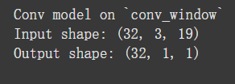

在 `conv_window` 上训练和评估上述模型，它应该提供与 `multi_step_dense` 模型类似的性能。
```py
history = compile_and_fit(conv_model, conv_window)

IPython.display.clear_output()
val_performance['Conv'] = conv_model.evaluate(conv_window.val)
performance['Conv'] = conv_model.evaluate(conv_window.test, verbose=0)
```
```
438/438 ━━━━━━━━━━━━━━━━━━━━ 2s 3ms/step - loss: 0.0067 - mean_absolute_error: 0.0583
```

此 `conv_model` 和 `multi_step_dense` 模型的区别在于，`conv_model` 可以在任意长度的输入上运行。卷积层应用于输入的滑动窗口：


如果在较宽的输入上运行此模型，它将生成较宽的输出：
```py
print("Wide window")
print('Input shape:', wide_window.example[0].shape)
print('Labels shape:', wide_window.example[1].shape)
print('Output shape:', conv_model(wide_window.example[0]).shape)

```

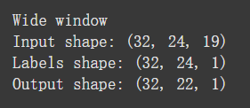

请注意，输出比输入短。要进行训练或绘图，需要标签和预测具有相同长度。因此，构建 `WindowGenerator` 以使用一些额外输入时间步骤生成宽窗口，从而使标签和预测长度匹配：
```py 
LABEL_WIDTH = 24
INPUT_WIDTH = LABEL_WIDTH + (CONV_WIDTH - 1)
wide_conv_window = WindowGenerator(
    input_width=INPUT_WIDTH,
    label_width=LABEL_WIDTH,
    shift=1,
    label_columns=['T (degC)'])

wide_conv_window
```
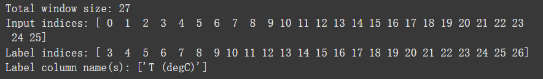

```py
print("Wide conv window")
print('Input shape:', wide_conv_window.example[0].shape)
print('Labels shape:', wide_conv_window.example[1].shape)
print('Output shape:', conv_model(wide_conv_window.example[0]).shape)
```


现在，您可以在更宽的窗口上绘制模型的预测。请注意第一个预测之前的 3 个输入时间步骤。这里的每个预测都基于之前的 3 个时间步骤：
```py
wide_conv_window.plot(conv_model)
```
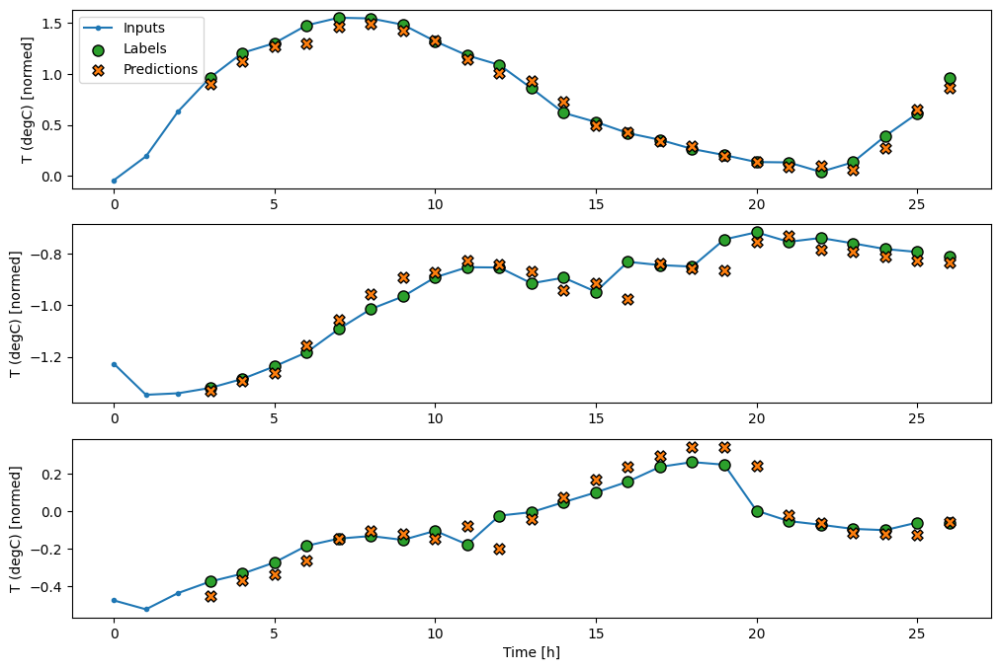

### 循环神经网络

循环神经网络 (RNN) 是一种非常适合时间序列数据的神经网络。RNN 分步处理时间序列，从时间步骤到时间步骤地维护内部状态。

您可以在[使用 RNN 的文本生成](https://tensorflow.google.cn/text/tutorials/text_generation?hl=zh-cn)教程和[使用 Keras 的递归神经网络 (RNN)](https://tensorflow.google.cn/guide/keras/rnn?hl=zh-cn) 指南中了解详情。

在本教程中，您将使用称为“长短期记忆网络[(tf.keras.layers.LSTM)](https://tensorflow.google.cn/api_docs/python/tf/keras/layers/LSTM?hl=zh-cn) 的 RNN 层。

对所有 Keras RNN 层（例如[tf.keras.layers.LSTM](https://tensorflow.google.cn/api_docs/python/tf/keras/layers/LSTM?hl=zh-cn)）都很重要的一个构造函数参数是 `return_sequences`。此设置可以通过以下两种方式配置层：

1. 如果为 `False`（默认值），则层仅返回最终时间步骤的输出，使模型有时间在进行单个预测前对其内部状态进行预热：
lstm 预热并进行单一预测
1. 如果为 True，层将为每个输入返回一个输出。这对以下情况十分有用：
    - 堆叠 RNN 层。
    - 同时在多个时间步骤上训练模型。


```py
lstm_model = tf.keras.models.Sequential([
    # Shape [batch, time, features] => [batch, time, lstm_units]
    tf.keras.layers.LSTM(32, return_sequences=True),
    # Shape => [batch, time, features]
    tf.keras.layers.Dense(units=1)
])
```
`return_sequences=True` 时，模型一次可以在 24 小时的数据上进行训练。

注：这将对模型的性能给出悲观看法。在第一个时间步骤中，模型无法访问之前的步骤，因此无法比之前展示的简单` linear` 和 `dense `模型表现得更好。

```py 
print('Input shape:', wide_window.example[0].shape)
print('Output shape:', lstm_model(wide_window.example[0]).shape)
```

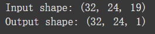

```py 

history = compile_and_fit(lstm_model, wide_window)

IPython.display.clear_output()
val_performance['LSTM'] = lstm_model.evaluate(wide_window.val)
performance['LSTM'] = lstm_model.evaluate(wide_window.test, verbose=0)
```

```
438/438 ━━━━━━━━━━━━━━━━━━━━ 3s 6ms/step - loss: 0.0056 - mean_absolute_error: 0.0518
```

```py
wide_window.plot(lstm_model)
```
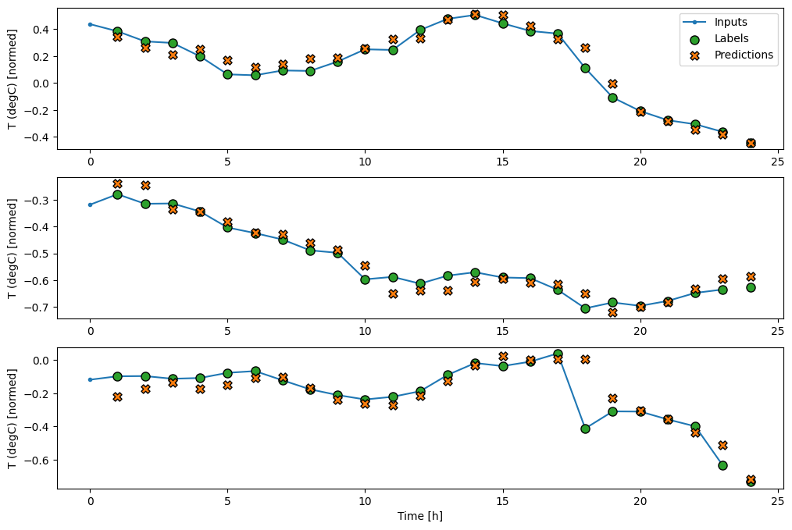

### 性能
使用此数据集时，通常每个模型的性能都比之前的模型稍好一些：
```py
x = np.arange(len(performance))
width = 0.3
metric_name = 'mean_absolute_error'
metric_index = lstm_model.metrics_names.index('mean_absolute_error')
val_mae = [v[metric_index] for v in val_performance.values()]
test_mae = [v[metric_index] for v in performance.values()]

plt.ylabel('mean_absolute_error [T (degC), normalized]')
plt.bar(x - 0.17, val_mae, width, label='Validation')
plt.bar(x + 0.17, test_mae, width, label='Test')
plt.xticks(ticks=x, labels=performance.keys(),
           rotation=45)
_ = plt.legend()
```

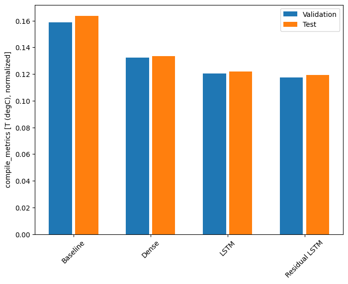

```py 
for name, value in performance.items():
  print(f'{name:12s}: {value[1]:0.4f}')
```

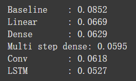

## 多输出模型

到目前为止，所有模型都为单个时间步骤预测了单个输出特征，`T (degC)`。

只需更改输出层中的单元数并调整训练窗口，以将所有特征包括在 `labels (example_labels)` 中，就可以将所有上述模型转换为预测多个特征：
```py
single_step_window = WindowGenerator(
    # `WindowGenerator` returns all features as labels if you 
    # don't set the `label_columns` argument.
    input_width=1, label_width=1, shift=1)

wide_window = WindowGenerator(
    input_width=24, label_width=24, shift=1)

for example_inputs, example_labels in wide_window.train.take(1):
  print(f'Inputs shape (batch, time, features): {example_inputs.shape}')
  print(f'Labels shape (batch, time, features): {example_labels.shape}')

```

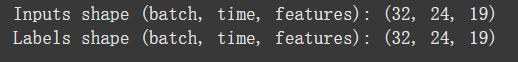

请注意，上面标签的 `features `轴现在具有与输入相同的深度，而不是 1。

### 基线
此处可以使用相同的基线模型 `(Baseline)`，但这次重复所有特征，而不是选择特定的 `label_index`：
```py 
baseline = Baseline()
baseline.compile(loss=tf.keras.losses.MeanSquaredError(),
                 metrics=[tf.keras.metrics.MeanAbsoluteError()])
```
```py 
val_performance = {}
performance = {}
val_performance['Baseline'] = baseline.evaluate(wide_window.val)
performance['Baseline'] = baseline.evaluate(wide_window.test, verbose=0)
```
```
438/438 ━━━━━━━━━━━━━━━━━━━━ 2s 4ms/step - loss: 0.0883 - mean_absolute_error: 0.1587
```

### 密集
```py
dense = tf.keras.Sequential([
    tf.keras.layers.Dense(units=64, activation='relu'),
    tf.keras.layers.Dense(units=64, activation='relu'),
    tf.keras.layers.Dense(units=num_features)
])
```
```py
dense = tf.keras.Sequential([
    tf.keras.layers.Dense(units=64, activation='relu'),
    tf.keras.layers.Dense(units=64, activation='relu'),
    tf.keras.layers.Dense(units=num_features)
])
```

```
439/439 ━━━━━━━━━━━━━━━━━━━━ 1s 3ms/step - loss: 0.0685 - mean_absolute_error: 0.1328
```
### RNN
```py
%%time
wide_window = WindowGenerator(
    input_width=24, label_width=24, shift=1)

lstm_model = tf.keras.models.Sequential([
    # Shape [batch, time, features] => [batch, time, lstm_units]
    tf.keras.layers.LSTM(32, return_sequences=True),
    # Shape => [batch, time, features]
    tf.keras.layers.Dense(units=num_features)
])

history = compile_and_fit(lstm_model, wide_window)

IPython.display.clear_output()
val_performance['LSTM'] = lstm_model.evaluate( wide_window.val)
performance['LSTM'] = lstm_model.evaluate( wide_window.test, verbose=0)

print()
```
```
438/438 ━━━━━━━━━━━━━━━━━━━━ 3s 7ms/step - loss: 0.0620 - mean_absolute_error: 0.1207

CPU times: user 9min 29s, sys: 38.9 s, total: 10min 8s
Wall time: 9min 21s
```
### 高级：残差连接

先前的 `Baseline` 模型利用了以下事实：序列在时间步骤之间不会剧烈变化。到目前为止，本教程中训练的每个模型都进行了随机初始化，然后必须学习输出相较上一个时间步骤改变较小这一知识。

尽管您可以通过仔细初始化来解决此问题，但将此问题构建到模型结构中则更加简单。

在时间序列分析中构建的模型，通常会预测下一个时间步骤中的值会如何变化，而非直接预测下一个值。类似地，深度学习中的[残差网络](https://arxiv.org/abs/1512.03385)（或 ResNet）指的是，每一层都会添加到模型的累计结果中的架构。

这就是利用“改变应该较小”这一知识的方式。

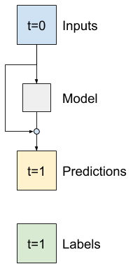

本质上，这将初始化模型以匹配 Baseline。对于此任务，它可以帮助模型更快收敛，且性能稍好。

该方法可以与本教程中讨论的任何模型结合使用。

这里将它应用于 LSTM 模型，请注意 [tf.initializers.zeros](https://tensorflow.google.cn/api_docs/python/tf/keras/initializers/Zeros?hl=zh-cn) 的使用，以确保初始的预测改变很小，并且不会压制残差连接。此处的梯度没有破坏对称性的问题，因为 `zeros` 仅用于最后一层。

```py
class ResidualWrapper(tf.keras.Model):
  def __init__(self, model):
    super().__init__()
    self.model = model

  def call(self, inputs, *args, **kwargs):
    delta = self.model(inputs, *args, **kwargs)

    # The prediction for each time step is the input
    # from the previous time step plus the delta
    # calculated by the model.
    return inputs + delta
```
```py 
%%time
residual_lstm = ResidualWrapper(
    tf.keras.Sequential([
    tf.keras.layers.LSTM(32, return_sequences=True),
    tf.keras.layers.Dense(
        num_features,
        # The predicted deltas should start small.
        # Therefore, initialize the output layer with zeros.
        kernel_initializer=tf.initializers.zeros())
]))

history = compile_and_fit(residual_lstm, wide_window)

IPython.display.clear_output()
val_performance['Residual LSTM'] = residual_lstm.evaluate(wide_window.val)
performance['Residual LSTM'] = residual_lstm.evaluate(wide_window.test, verbose=0)
print()
```
```
438/438 ━━━━━━━━━━━━━━━━━━━━ 4s 9ms/step - loss: 0.0621 - mean_absolute_error: 0.1177

CPU times: user 3min 10s, sys: 13.4 s, total: 3min 24s
Wall time: 3min 6s
```

### 性能 
以下是这些多输出模型的整体性能。
```py 
x = np.arange(len(performance))
width = 0.3

metric_name = 'mean_absolute_error'
metric_index = lstm_model.metrics_names.index('mean_absolute_error')
val_mae = [v[metric_index] for v in val_performance.values()]
test_mae = [v[metric_index] for v in performance.values()]

plt.bar(x - 0.17, val_mae, width, label='Validation')
plt.bar(x + 0.17, test_mae, width, label='Test')
plt.xticks(ticks=x, labels=performance.keys(),
           rotation=45)
plt.ylabel('MAE (average over all outputs)')
_ = plt.legend()
```
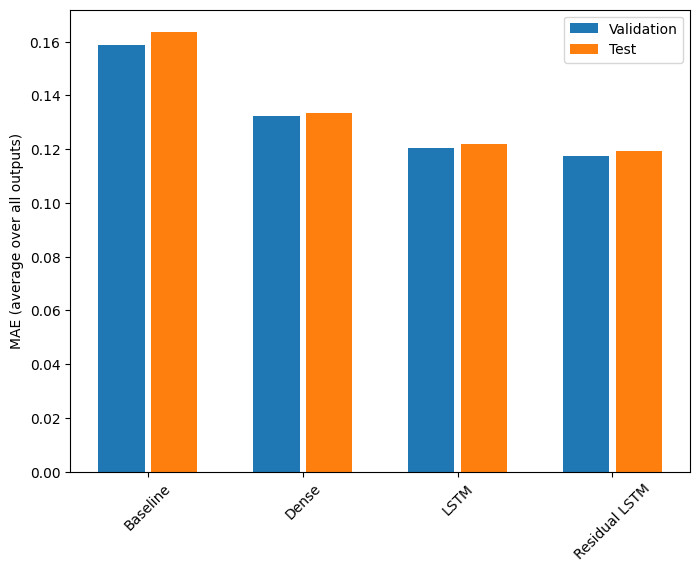

```py
for name, value in performance.items():
  print(f'{name:15s}: {value[1]:0.4f}')
```
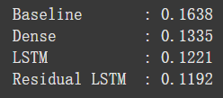
以上性能是所有模型输出的平均值。

## 多步模型

前几个部分中的单输出和多输出模型都对未来 1 小时进行**单个时间步骤预测**。
本部分介绍如何扩展这些模型以进行**多时间步骤预测**。
在多步预测中，模型需要学习预测一系列未来值。因此，与单步模型（仅预测单个未来点）不同，多步模型预测未来值的序列。

大致有两种预测方法：

1. 单次预测，一次预测整个时间序列。
1. 自回归预测，模型仅进行单步预测并将输出作为输入进行反馈。

在本部分中，所有模型都将预测**所有输出时间步骤中的所有特征**。

对于多步模型而言，训练数据仍由每小时样本组成。但是，在这里，模型将在给定过去 24 小时的情况下学习预测未来 24 小时。

下面是一个 `Window`对象，该对象从数据集生成以下切片：
```py
OUT_STEPS = 24
multi_window = WindowGenerator(input_width=24,
                               label_width=OUT_STEPS,
                               shift=OUT_STEPS)

multi_window.plot()
multi_window
```
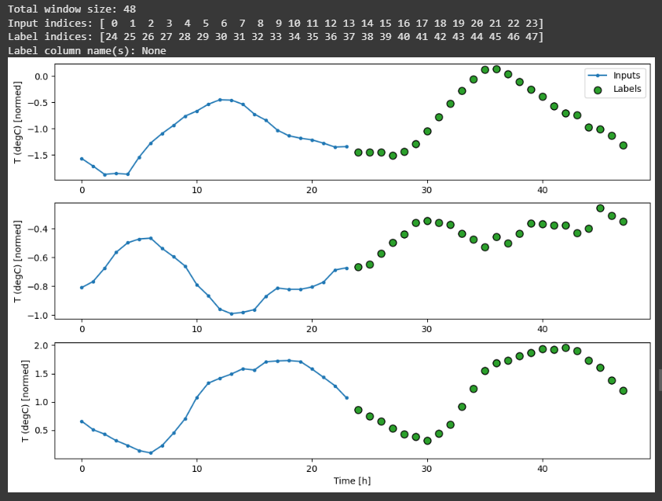
### 基线
此任务的一个简单基线是针对所需数量的输出时间步骤重复上一个输入时间步骤：

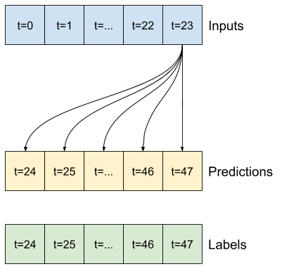

```py 
class MultiStepLastBaseline(tf.keras.Model):
  def call(self, inputs):
    return tf.tile(inputs[:, -1:, :], [1, OUT_STEPS, 1])

last_baseline = MultiStepLastBaseline()
last_baseline.compile(loss=tf.keras.losses.MeanSquaredError(),
                      metrics=[tf.keras.metrics.MeanAbsoluteError()])

multi_val_performance = {}
multi_performance = {}

multi_val_performance['Last'] = last_baseline.evaluate(multi_window.val)
multi_performance['Last'] = last_baseline.evaluate(multi_window.test, verbose=0)
multi_window.plot(last_baseline)
```

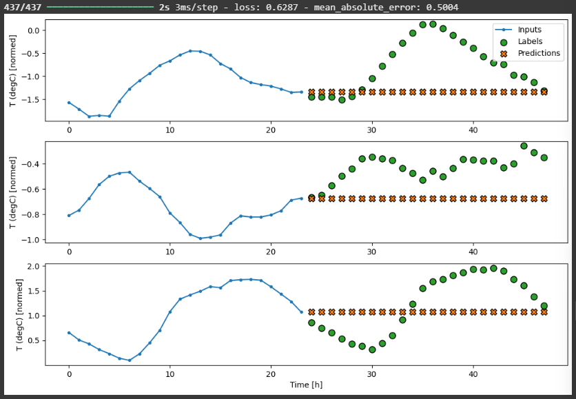

由于此任务是在给定过去 24 小时的情况下预测未来 24 小时，另一种简单的方式是重复前一天，假设明天是类似的：

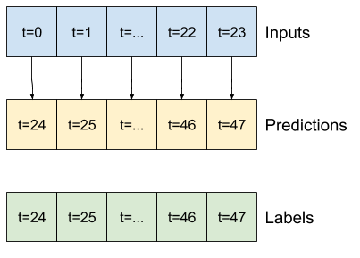

```py 
class RepeatBaseline(tf.keras.Model):
  def call(self, inputs):
    return inputs

repeat_baseline = RepeatBaseline()
repeat_baseline.compile(loss=tf.keras.losses.MeanSquaredError(),
                        metrics=[tf.keras.metrics.MeanAbsoluteError()])

multi_val_performance['Repeat'] = repeat_baseline.evaluate(multi_window.val)
multi_performance['Repeat'] = repeat_baseline.evaluate(multi_window.test, verbose=0)
multi_window.plot(repeat_baseline)
```

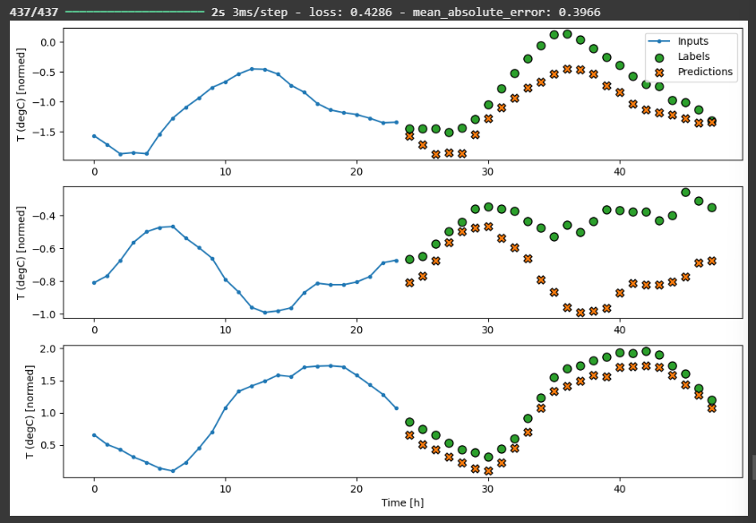

### 单次模型

解决此问题的一种高级方法是使用“单次”模型，该模型可以在单个步骤中对整个序列进行预测。

这可以使用 `OUT_STEPS*features` 输出单元作为 `tf.keras.layers.Dense` 高效实现。模型只需要将输出调整为所需的 `(OUTPUT_STEPS, features)`。

### 线性

基于最后输入时间步骤的简单线性模型优于任何基线，但能力不足。该模型需要根据线性投影的单个输入时间步骤来预测 `OUTPUT_STEPS` 个时间步骤。它只能捕获行为的低维度切片，可能主要基于一天中的时间和一年中的时间。

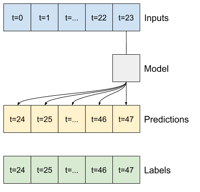

```py 
multi_linear_model = tf.keras.Sequential([
    # Take the last time-step.
    # Shape [batch, time, features] => [batch, 1, features]
    tf.keras.layers.Lambda(lambda x: x[:, -1:, :]),
    # Shape => [batch, 1, out_steps*features]
    tf.keras.layers.Dense(OUT_STEPS*num_features,
                          kernel_initializer=tf.initializers.zeros()),
    # Shape => [batch, out_steps, features]
    tf.keras.layers.Reshape([OUT_STEPS, num_features])
])

history = compile_and_fit(multi_linear_model, multi_window)

IPython.display.clear_output()
multi_val_performance['Linear'] = multi_linear_model.evaluate(multi_window.val)
multi_performance['Linear'] = multi_linear_model.evaluate(multi_window.test, verbose=0)
multi_window.plot(multi_linear_model)
```

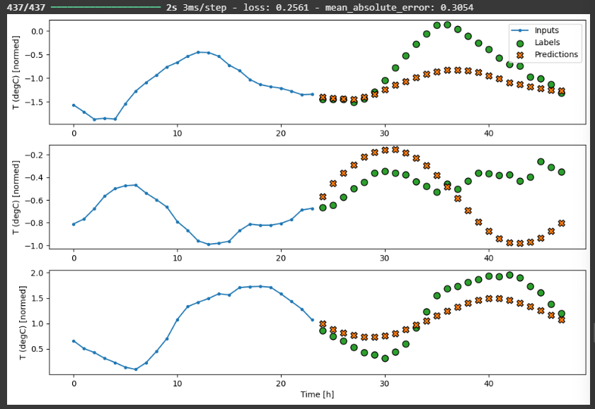

### 密集

在输入和输出之间添加 `tf.keras.layers.Dense` 可为线性模型提供更大能力，但仍仅基于单个输入时间步骤。

```py 
multi_dense_model = tf.keras.Sequential([
    # Take the last time step.
    # Shape [batch, time, features] => [batch, 1, features]
    tf.keras.layers.Lambda(lambda x: x[:, -1:, :]),
    # Shape => [batch, 1, dense_units]
    tf.keras.layers.Dense(512, activation='relu'),
    # Shape => [batch, out_steps*features]
    tf.keras.layers.Dense(OUT_STEPS*num_features,
                          kernel_initializer=tf.initializers.zeros()),
    # Shape => [batch, out_steps, features]
    tf.keras.layers.Reshape([OUT_STEPS, num_features])
])

history = compile_and_fit(multi_dense_model, multi_window)

IPython.display.clear_output()
multi_val_performance['Dense'] = multi_dense_model.evaluate(multi_window.val)
multi_performance['Dense'] = multi_dense_model.evaluate(multi_window.test, verbose=0)
multi_window.plot(multi_dense_model)
```
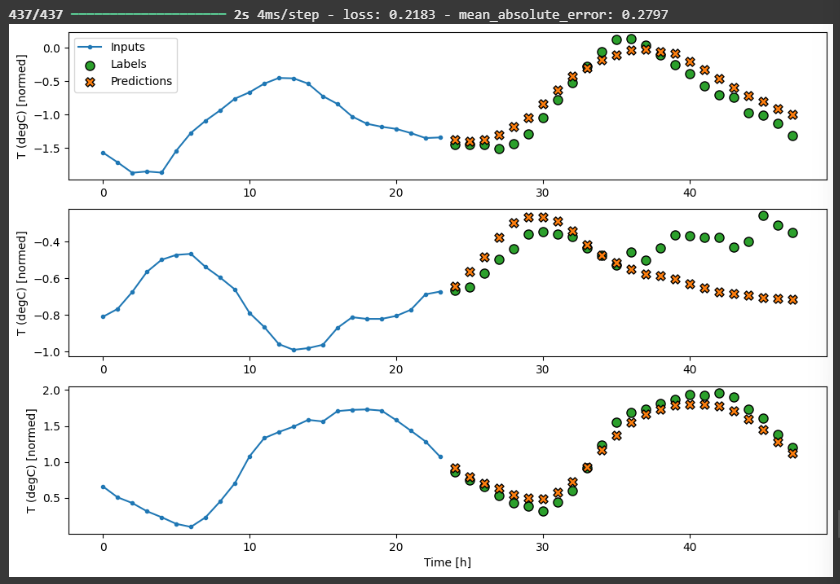

### CNN
卷积模型基于固定宽度的历史记录进行预测，可能比密集模型的性能更好，因为它可以看到随时间变化的情况：


```py 
CONV_WIDTH = 3
multi_conv_model = tf.keras.Sequential([
    # Shape [batch, time, features] => [batch, CONV_WIDTH, features]
    tf.keras.layers.Lambda(lambda x: x[:, -CONV_WIDTH:, :]),
    # Shape => [batch, 1, conv_units]
    tf.keras.layers.Conv1D(256, activation='relu', kernel_size=(CONV_WIDTH)),
    # Shape => [batch, 1,  out_steps*features]
    tf.keras.layers.Dense(OUT_STEPS*num_features,
                          kernel_initializer=tf.initializers.zeros()),
    # Shape => [batch, out_steps, features]
    tf.keras.layers.Reshape([OUT_STEPS, num_features])
])

history = compile_and_fit(multi_conv_model, multi_window)

IPython.display.clear_output()

multi_val_performance['Conv'] = multi_conv_model.evaluate(multi_window.val)
multi_performance['Conv'] = multi_conv_model.evaluate(multi_window.test, verbose=0)
multi_window.plot(multi_conv_model)
```
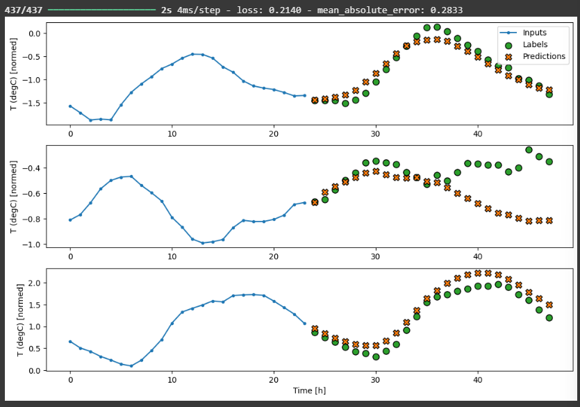

### RNN

如果循环模型与模型所做的预测相关，则可以学习使用较长的输入历史记录。在这里，模型将积累 24 小时的内部状态，然后对接下来的 24 小时进行单次预测。

在此单次格式中，LSTM 只需要在最后一个时间步骤上生成输出，因此在 `tf.keras.layers.LSTM `中设置 `return_sequences=False`。

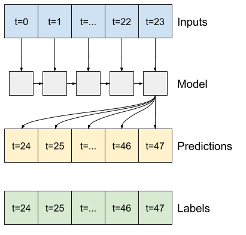

```py 
multi_lstm_model = tf.keras.Sequential([
    # Shape [batch, time, features] => [batch, lstm_units].
    # Adding more `lstm_units` just overfits more quickly.
    tf.keras.layers.LSTM(32, return_sequences=False),
    # Shape => [batch, out_steps*features].
    tf.keras.layers.Dense(OUT_STEPS*num_features,
                          kernel_initializer=tf.initializers.zeros()),
    # Shape => [batch, out_steps, features].
    tf.keras.layers.Reshape([OUT_STEPS, num_features])
])

history = compile_and_fit(multi_lstm_model, multi_window)

IPython.display.clear_output()

multi_val_performance['LSTM'] = multi_lstm_model.evaluate(multi_window.val)
multi_performance['LSTM'] = multi_lstm_model.evaluate(multi_window.test, verbose=0)
multi_window.plot(multi_lstm_model)
```


### 高级：自回归模型
上述模型均在单个步骤中预测整个输出序列。

在某些情况下，模型将此预测分解为单个时间步骤可能比较有帮助。 然后，模型的每个输出都可以在每个步骤反馈给自己，并可以根据前一个输出进行预测，就像经典的[使用循环神经网络生成序列](https://arxiv.org/abs/1308.0850)中介绍的一样。

此类模型的一个明显优势是可以将其设置为生成长度不同的输出。

您可以采用本教程前半部分中训练的任意一个单步多输出模型，并在自回归反馈循环中运行，但是在这里，您将重点关注经过显式训练的模型。


### RNN

本教程仅构建自回归 RNN 模型，但是该模式可以应用于设计为输出单个时间步骤的任何模型。

模型将具有与之前的单步 LSTM 模型相同的基本形式：一个 [tf.keras.layers.LSTM](https://tensorflow.google.cn/api_docs/python/tf/keras/layers/LSTM?hl=zh-cn) ，后接一个将 LSTM 层输出转换为模型预测的 [tf.keras.layers.Dense](https://tensorflow.google.cn/api_docs/python/tf/keras/layers/Dense?hl=zh-cn) 层。

[tf.keras.layers.LSTM](https://tensorflow.google.cn/api_docs/python/tf/keras/layers/LSTM?hl=zh-cn) 是封装在更高级 [tf.keras.layers.RNN](https://tensorflow.google.cn/api_docs/python/tf/keras/layers/RNN?hl=zh-cn) 中的 [tf.keras.layers.LSTMCell](https://tensorflow.google.cn/api_docs/python/tf/keras/layers/LSTMCell?hl=zh-cn)，它为您管理状态和序列结果（有关详细信息，请参阅[使用 Keras 的循环神经网络 (RNN)](https://tensorflow.google.cn/guide/keras/rnn?hl=zh-cn) 指南）。

在这种情况下，模型必须手动管理每个步骤的输入，因此它直接将 [tf.keras.layers.LSTMCell](https://tensorflow.google.cn/api_docs/python/tf/keras/layers/LSTMCell?hl=zh-cn) 用于较低级别的单个时间步骤接口。

```py
class FeedBack(tf.keras.Model):
  def __init__(self, units, out_steps):
    super().__init__()
    self.out_steps = out_steps
    self.units = units
    self.lstm_cell = tf.keras.layers.LSTMCell(units)
    # Also wrap the LSTMCell in an RNN to simplify the `warmup` method.
    self.lstm_rnn = tf.keras.layers.RNN(self.lstm_cell, return_state=True)
    self.dense = tf.keras.layers.Dense(num_features)
```
```py 
feedback_model = FeedBack(units=32, out_steps=OUT_STEPS)
```
该模型需要的第一个方法是 `warmup`，用来根据输入初始化其内部状态。训练后，此状态将捕获输入历史记录的相关部分。这等效于先前的单步 `LSTM` 模型：

```py
def warmup(self, inputs):
  # inputs.shape => (batch, time, features)
  # x.shape => (batch, lstm_units)
  x, *state = self.lstm_rnn(inputs)

  # predictions.shape => (batch, features)
  prediction = self.dense(x)
  return prediction, state

FeedBack.warmup = warmup
```
此方法返回单个时间步骤预测以及 `LSTM `的内部状态：

```py 
prediction, state = feedback_model.warmup(multi_window.example[0])
prediction.shape
```

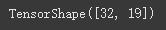

有了 `RNN` 的状态和初始预测，您现在可以继续迭代模型，并在每一步将预测作为输入反馈给模型。

收集输出预测的最简单方式是使用 Python 列表，并在循环后使用 [tf.stack](https://tensorflow.google.cn/api_docs/python/tf/stack?hl=zh-cn)。

注：像这样堆叠 Python 列表仅适用于 Eager-Execution，使用 [Model.compile(..., run_eagerly=True)](https://tensorflow.google.cn/api_docs/python/tf/keras/Model?hl=zh-cn#compile) 进行训练，或使用固定长度的输出。对于动态输出长度，您需要使用 [tf.TensorArray](https://tensorflow.google.cn/api_docs/python/tf/TensorArray?hl=zh-cn) 代替 Python 列表，并用 [tf.range](https://tensorflow.google.cn/api_docs/python/tf/range?hl=zh-cn) 代替 Python range。

```py 
def call(self, inputs, training=None):
  # Use a TensorArray to capture dynamically unrolled outputs.
  predictions = []
  # Initialize the LSTM state.
  prediction, state = self.warmup(inputs)

  # Insert the first prediction.
  predictions.append(prediction)

  # Run the rest of the prediction steps.
  for n in range(1, self.out_steps):
    # Use the last prediction as input.
    x = prediction
    # Execute one lstm step.
    x, state = self.lstm_cell(x, states=state,
                              training=training)
    # Convert the lstm output to a prediction.
    prediction = self.dense(x)
    # Add the prediction to the output.
    predictions.append(prediction)

  # predictions.shape => (time, batch, features)
  predictions = tf.stack(predictions)
  # predictions.shape => (batch, time, features)
  predictions = tf.transpose(predictions, [1, 0, 2])
  return predictions

FeedBack.call = call
```

在示例输入上运行此模型：
```py
print('Output shape (batch, time, features): ', feedback_model(multi_window.example[0]).shape)
```

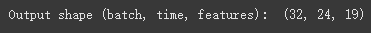

现在，训练模型：
```py 
history = compile_and_fit(feedback_model, multi_window)

IPython.display.clear_output()

multi_val_performance['AR LSTM'] = feedback_model.evaluate(multi_window.val)
multi_performance['AR LSTM'] = feedback_model.evaluate(multi_window.test, verbose=0)
multi_window.plot(feedback_model)
```

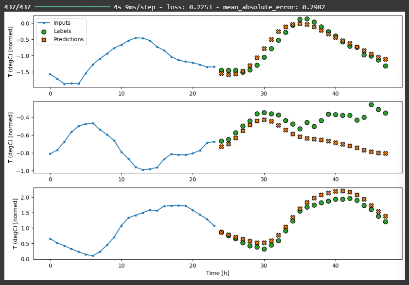

### 性能
在这个问题上，作为模型复杂性的函数，返回值在明显递减。
```py 
x = np.arange(len(multi_performance))
width = 0.3

metric_name = 'mean_absolute_error'
metric_index = lstm_model.metrics_names.index('mean_absolute_error')
val_mae = [v[metric_index] for v in multi_val_performance.values()]
test_mae = [v[metric_index] for v in multi_performance.values()]

plt.bar(x - 0.17, val_mae, width, label='Validation')
plt.bar(x + 0.17, test_mae, width, label='Test')
plt.xticks(ticks=x, labels=multi_performance.keys(),
           rotation=45)
plt.ylabel(f'MAE (average over all times and outputs)')
_ = plt.legend()
```


本教程前半部分的多输出模型的指标显示了所有输出特征的平均性能。这些性能类似，但在输出时间步骤上也进行了平均。

```py 
for name, value in multi_performance.items():
  print(f'{name:8s}: {value[1]:0.4f}')
```

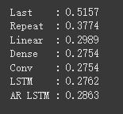

从密集模型到卷积模型和循环模型，所获得的增益只有百分之几（如果有的话），而自回归模型的表现显然更差。因此，在**这个**问题上使用这些更复杂的方法可能并不值得，但如果不尝试就无从知晓，而且这些模型可能会对**您的**问题有所帮助。

## 后续步骤

本教程是使用 TensorFlow 进行时间序列预测的简单介绍。

要了解更多信息，请参阅：

- [Hands-on Machine Learning with Scikit-Learn, Keras, and TensorFlow](https://www.oreilly.com/library/view/hands-on-machine-learning/9781492032632/)（第 2 版）第 15 章。
- [Python 深度学习](https://www.manning.com/books/deep-learning-with-python)第 6 章。
- [Udacity 的 Intro to TensorFlow for deep learning](https://www.udacity.com/course/intro-to-tensorflow-for-deep-learning--ud187) 第 8 课，包括[练习笔记本](https://github.com/tensorflow/examples/tree/master/courses/udacity_intro_to_tensorflow_for_deep_learning)。
还要记住，您可以在 TensorFlow 中实现任何[经典时间序列模型](https://otexts.com/fpp2/index.html)，本教程仅重点介绍了 TensorFlow 的内置功能。
